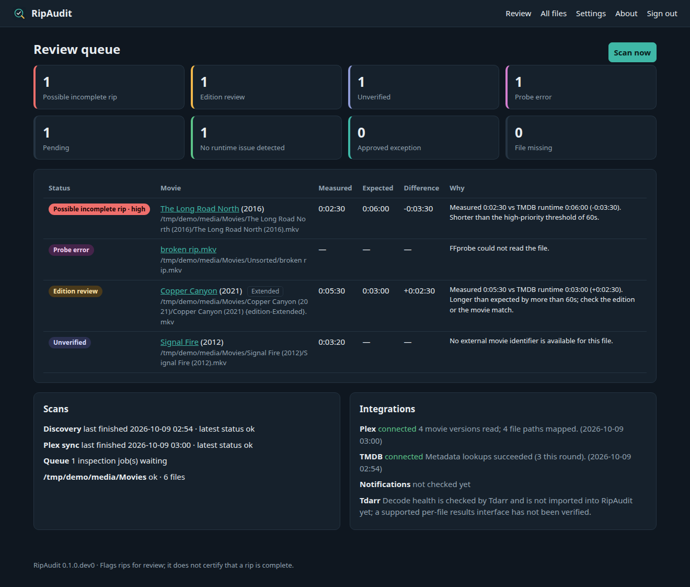

# RipAudit

**Automatic runtime checks for your movie rips.**

RipAudit watches your movie folders, measures each file with FFprobe, uses Plex's identification to fetch an independent runtime from TMDB, and lists the files that need a closer look: possible incomplete rips, edition mismatches, unmatched movies, and unreadable files. It complements [Tdarr](https://docs.tdarr.io/), which handles full-file decode health checks.

> **Status: development build (0.1.0.dev0).** No container image has been published and RipAudit has not been submitted to Unraid Community Applications. The Unraid template in `unraid/` is a development artifact.



## What it does

- Discovers MKV and MP4 files under one or more read-only media roots, on a schedule or on demand.
- Waits for files to stop changing, then reads their duration and track inventory with FFprobe. It never reads whole files during routine scans and never modifies media.
- Matches each file to its Plex movie and version (including multipart movies and editions) through configurable path mappings.
- Looks up the expected runtime on TMDB by the TMDB or IMDb ID Plex already has. Title search is optional and always needs your confirmation.
- Lets you enter the runtime of the exact disc title you ripped (for example the title length shown in DVDFab), scoped to that file version.
- Shows an exceptions-first review queue, a searchable inventory, per-file history, and CSV/JSON exports.
- Lets you approve exceptions with a reason. Approvals are tied to the exact file version and are invalidated if the file is replaced, unless you choose to keep them.
- Sends deduplicated ntfy or webhook notifications for new high-priority issues and an optional daily digest.

## What the results mean

| Result | Meaning |
|---|---|
| Possible incomplete rip | Measurably shorter than the reference. High priority when the shortfall passes the high threshold. |
| Edition review | Longer than the reference, or moderately shorter when Plex reports an edition that may explain it. |
| Unverified | No trustworthy match or no reference runtime. Never treated as passing. |
| Probe error | FFprobe could not read the file, timed out, or found no duration. |
| No runtime issue detected | Within tolerance of the reference. **This is not proof that the rip is complete.** |
| Approved exception | You reviewed it and recorded a reason. |
| Pending | Still settling, waiting for inspection, or waiting for Plex to index it. |

A matching runtime cannot prove that every frame, audio track, subtitle, or extra is present, and TMDB's runtime is one general figure that may describe a different cut than your disc. Use Tdarr's thorough health check for decode errors.

## Quick start

```bash
docker build -t ripaudit .
docker run -d --name ripaudit --user 99:100 -p 8080:8080 \
  -v /path/to/appdata:/config \
  -v /path/to/Movies:/media/Movies:ro \
  ripaudit
```

Open `http://<server>:8080`, enter the setup token from `appdata/setup-token`, create your account, then add your Plex URL and token, a TMDB API Read Access Token, and a path mapping such as `/data/Movies => /media/Movies`.

- [Unraid installation](docs/unraid-installation.md)
- [Installation and configuration (any Docker host)](docs/installation.md)
- [How it works](docs/how-it-works.md)
- [Integrations and API references](docs/integrations.md)
- [Security and deployment](docs/security.md) · [Privacy](PRIVACY.md)
- [Troubleshooting](docs/troubleshooting.md)
- [Architecture and roadmap](docs/architecture.md)

## Development

```bash
python -m venv .venv && . .venv/bin/activate
pip install -e ".[dev]"
ruff check src tests
pytest -q
```

Tests use small synthetic media generated with FFmpeg and mocked Plex/TMDB services; FFmpeg must be installed for the real-FFprobe tests. `scripts/dev_mock_services.py` runs a local mock of the Plex and TMDB endpoints for demos; see [CONTRIBUTING.md](CONTRIBUTING.md).

## Credits and trademarks

This product uses the TMDB API but is not endorsed or certified by TMDB. RipAudit is an independent project and is not affiliated with or endorsed by Plex, TMDB, Tdarr, DVDFab, or Unraid. RipAudit has no ripping, DRM-circumvention, downloading, or redistribution features.

## License

RipAudit is released under the [MIT License](LICENSE). The TMDB logo is TMDB's trademark and is not covered by this license.
